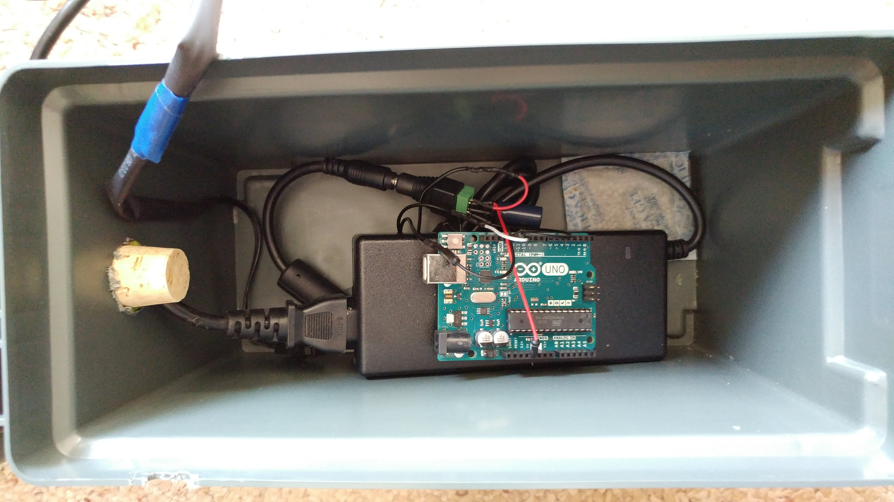
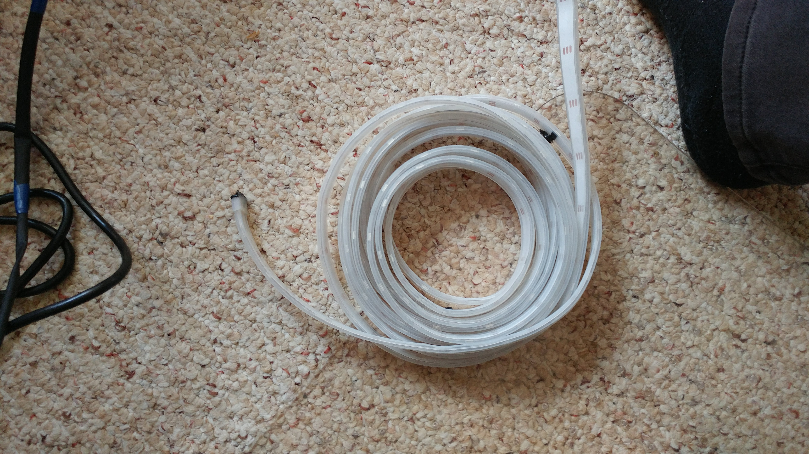
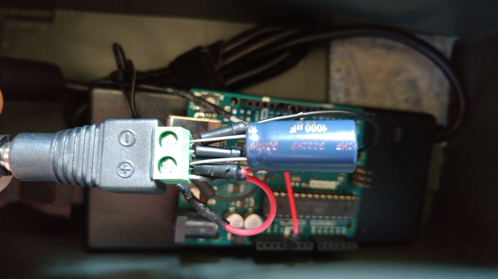

# Xmaslights
Christmas lights using Adafruit Mega Pixels and Arduino

# Hardware
* Arduino Uno (Any of the clones should work)
* [Adafruit NeoPixel Digital RGB LED Strip - White 30 LED](https://www.adafruit.com/product/1376) The code is set up for 5 meters or 150 pixels.
* [5V/10A power supply](https://www.adafruit.com/product/658)  Sort of overkill, but you can't have too much power.
* [Female DC Power adapter - 2.1mm jack to screw terminal block](https://www.adafruit.com/product/368)
* 1000 µF, 6.3V or higher capacitor
* [3-pin JST SM Plug + Receptacle Cable Set](https://www.adafruit.com/product/1663) to make it easier to plug things in.
* If you want to put it outside, you'll need some sort of watertight case like [this](https://www.sciplus.com/lightweight-plastic-ammo-style-locking-case-62311-p).

# Set up
Read the [Adafruit NeoPixel Überguide](https://learn.adafruit.com/adafruit-neopixel-uberguide)

Female DC Power adapter
	- Connect power to Arduino 5V input
	- Connect ground to Arduino ground
	- Connect power and ground to NeoPixels power/ground
	- Connect capacitor across terminals




[Video of the lights in action](https://photos.app.goo.gl/eXfG7bFZ4jLRYyn28)

The data line from the NeoPixels to pin 11 on the Arduino (adjust in code if you want to use a different pin).

# Explanation
The code is set up for 150 pixels.  If you are using a different size strip, you need to change this line:
```
Adafruit_NeoPixel strip = Adafruit_NeoPixel(150, PIN, NEO_GRB + NEO_KHZ800);
```
Be aware that the NeoPixels tend to take up alot of memory.  So if you want to do more pixels, you might need to update to something with more memory than an Uno.

The algorythm is this:
+ Assign all LEDs a random color.  The color is set by a red/green/blue value.  The `random(0,2)` effectively acts like a boolean to turn off/on that color component.
+ Every loop 
++ For each pixel reduce the brightness of the red, green or blue (randomly chosen) by a random amount.
++ If the pixel is dark (i.e. red/green/blue all zero), reset to random bright color.

The end result is a slowly diming, color changing set of pixels.  While they all start bright, the will dim a varying rates and quickly go to a slowly diming/brightening mode.

